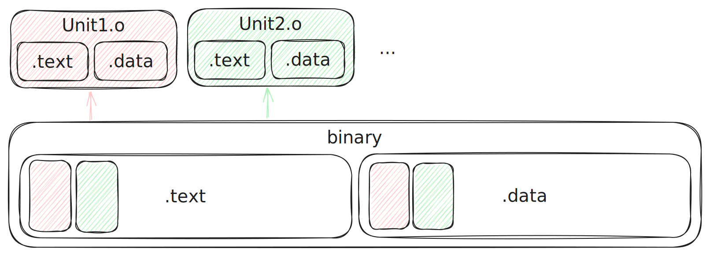

# decomp-toolkit [![Build Status]][actions]

[Build Status]: https://github.com/encounter/decomp-toolkit/actions/workflows/build.yml/badge.svg
[actions]: https://github.com/encounter/decomp-toolkit/actions

Yet another GameCube/Wii decompilation toolkit.

decomp-toolkit functions both as a command-line tool for developers, and as a replacement for various parts of a
decompilation project's build system.

For use in a new decompilation project, see [dtk-template](https://github.com/encounter/dtk-template), which provides a
project structure and build system that uses decomp-toolkit under the hood.

## Sections

- [Goals](#goals)
- [Background](#background)
- [Analyzer features](#analyzer-features)
- [Other approaches](docs/other_approaches.md)
- [Terminology](docs/terminology.md)
- [Commands](#commands)
  - [ar create](#ar-create)
  - [ar extract](#ar-extract)
  - [demangle](#demangle)
  - [disc info](#disc-info)
  - [disc extract](#disc-extract)
  - [disc convert](#disc-convert)
  - [disc verify](#disc-verify)
  - [dol info](#dol-info)
  - [dol split](#dol-split)
  - [dol diff](#dol-diff)
  - [dol apply](#dol-apply)
  - [dol config](#dol-config)
  - [dwarf dump](#dwarf-dump)
  - [elf disasm](#elf-disasm)
  - [elf fixup](#elf-fixup)
  - [elf2dol](#elf2dol)
  - [map](#map)
  - [rel info](#rel-info)
  - [rel merge](#rel-merge)
  - [rso info](#rso-info)
  - [rso make](#rso-make)
  - [shasum](#shasum)
  - [nlzss decompress](#nlzss-decompress)
  - [rarc list](#rarc-list)
  - [rarc extract](#rarc-extract)
  - [u8 list](#u8-list)
  - [u8 extract](#u8-extract)
  - [yay0 decompress](#yay0-decompress)
  - [yay0 compress](#yay0-compress)
  - [yaz0 decompress](#yaz0-decompress)
  - [yaz0 compress](#yaz0-compress)

## Goals

- Automate as much as possible, allowing developers to focus on matching code rather than months-long tedious setup.
- Provide highly **accurate** and performant analysis and tooling.
- Provide everything in a single portable binary. This simplifies project setup: a script can simply fetch the
  binary from GitHub.
- Replace common usages of msys2 and GNU assembler, eliminating the need to depend on devkitPro.
- Integrate well with other decompilation tooling like [objdiff](https://github.com/encounter/objdiff) and
  [decomp.me](https://decomp.me).

## Background

The goal of a matching decompilation project is to write C/C++ code that compiles back to the _exact_ same binary as
the original game. This often requires using the same compiler as the original game. (For GameCube and Wii,
[Metrowerks CodeWarrior](https://en.wikipedia.org/wiki/CodeWarrior))

When compiling C/C++ code, the compiler (in our case, `mwcceppc`) generates an object file (`.o`) for every source file.
This object file contains the compiled machine code, as well as information that the linker (`mwldeppc`) uses to
generate the final executable.

One way to verify that our code is a match is by taking any code that has been decompiled, and
linking it alongside portions of the original binary that have not been decompiled yet. First, we create relocatable
objects from the original binary:

<picture>
  <source media="(prefers-color-scheme: dark)" srcset="assets/diagram_dark.svg">
  <source media="(prefers-color-scheme: light)" srcset="assets/diagram_light.svg">
  
</picture>

(Heavily simplified)

Then, each object can be replaced by a decompiled version as matching code is written. If the linker still generates a
binary that is byte-for-byte identical to the original, then we know that the decompiled code is a match.

decomp-toolkit provides tooling for analyzing and splitting the original binary into relocatable objects, as well
as generating the linker script and other files needed to link the decompiled code.


## Analyzer features

**Function boundary analysis**  
Discovers function boundaries with high accuracy. Uses various heuristics to disambiguate tail calls from
inner-function control flow.

**Signature analysis**  
Utilizes a built-in signature database to identify common Metrowerks and SDK functions and objects.  
This also helps decomp-toolkit automatically generate required splits, like `__init_cpp_exceptions`.

**Relocation analysis**  
Performs control-flow analysis and rebuilds relocations with high accuracy.  
With some manual tweaking (mainly in data), this should generate fully-shiftable objects.

**Section analysis**  
Automatically identifies DOL and REL sections based on information from signature and relocation analysis.

**Object analysis**  
Attempts to identify the type and size of data objects by analyzing usage.  
Also attempts to identify string literals, wide string literals, and string tables.

**Splitting**  
Generates split object files in memory based on user configuration.  
In order to support relinking with `mwldeppc.exe`, any **unsplit** `.ctors`, `.dtors`, `extab` and `extabindex` entries
are analyzed and automatically split along with their associated functions. This ensures that the linker will properly
generate these sections without any additional configuration.  
A topological sort is performed to determine the final link order of the split objects.

**Object file writing**  
Writes object files directly, with no assembler required. (Bye devkitPPC!)  
If desired, optionally writes GNU assembler-compatible files alongside the object files.

**Linker script generation**  
Generates `ldscript.lcf` for `mwldeppc.exe`.

**Future work**

- Support RSO files
- Add more signatures

## Commands

### ar create

Create a static library (.a) from the input objects.

```shell
$ dtk ar create out.a input_1.o input_2.o
# or
$ echo input_1.o >> rspfile
$ echo input_2.o >> rspfile
$ dtk ar create out.a @rspfile
```

### ar extract

Extracts the contents of static library (.a) files.

Accepts multiple files, glob patterns (e.g. `*.a`) and response files (e.g. `@rspfile`).

Options:
- `-o`, `--out <output-dir>`: Output directory. Defaults to the current directory.
- `-v`, `--verbose`: Verbose output.
- `-q`, `--quiet`: Suppresses all output except errors.

```shell
# Extracts to outdir
$ dtk ar extract lib.a -o outdir

# With multiple inputs, extracts to separate directories
# Extracts to outdir/lib1, outdir/lib2
$ dtk ar extract lib1.a lib2.a -o outdir
```

### demangle

Demangles CodeWarrior C++ symbols. A thin wrapper for [cwdemangle](https://github.com/encounter/cwdemangle).

```shell
$ dtk demangle 'BuildLight__9CGuiLightCFv'
CGuiLight::BuildLight() const
```

### disc info

_`disc` commands are wrappers around the [nod](https://github.com/encounter/nod-rs) library
and its `nodtool` command line tool._

Displays information about disc images.

Supported disc image formats:

- ISO (GCM)
- WIA / RVZ
- WBFS (+ NKit 2 lossless)
- CISO (+ NKit 2 lossless)
- NFS (Wii U VC)
- GCZ

```shell
$ dtk disc info /path/to/game.iso
```

### disc extract

Extracts the contents of disc images to a directory.

See [disc info](#disc-info) for supported formats.

```shell
$ dtk disc extract /path/to/game.iso [outdir]
```

By default, only the main **data** partition is extracted.  
Use the `-p`/`--partition` option to choose a different partition.  
(Options: `all`, `data`, `update`, `channel`, or a partition index)

### disc convert

Converts any supported disc image to raw ISO (GCM).

If the format is lossless, the output will be identical to the original disc image.

See [disc info](#disc-info) for supported formats.

```shell
$ dtk disc convert /path/to/game.wia /path/to/game.iso
```

### disc verify

Hashes the contents of a disc image and verifies it against a built-in [Redump](http://redump.org/) database.

See [disc info](#disc-info) for supported formats.

```shell
$ dtk disc verify /path/to/game.iso
```

### dol info

Analyzes a DOL file and outputs information section and symbol information.

```shell
$ dtk dol info input.dol
```

### dol split

> [!NOTE]  
> This command is a work-in-progress.

Analyzes and splits a DOL file into relocatable objects based on user configuration.

**This command is intended to be used as part of a decompilation project's build system.**  
For an example project structure and for documentation on the configuration, see
[dtk-template](https://github.com/encounter/dtk-template).

```shell
$ dtk dol split config.yml target
```

### dol diff

Simple diff tool for issues in a linked ELF. (Yes, not DOL. It's misnamed.)  
Tries to find the most obvious difference causing a mismatch.

Pass in the project configuration file, and the path to the linked ELF file to compare against.

```shell
$ dtk dol diff config.yml build/main.elf
```

### dol apply

Applies updated symbols from a linked ELF to the project configuration. (Again, misnamed.)

Useful after matching a file. It will pull updated symbol information from the final result.

```shell
$ dtk dol apply config.yml build/main.elf
```

### dol config

Generates an initial project configuration file from a DOL (& RELs).

Pass in the DOL file, and any REL files that are linked with it.  
Or, for Wii games, pass in the `selfile.sel`. (Not RSOs)

```shell
$ dtk dol config main.dol rels/*.rel -o config.yml
```

### dwarf dump

Dumps DWARF 1.1 information from an ELF file. (Does **not** support DWARF 2+)

```shell
$ dtk dwarf dump input.elf
```

### elf disasm

Disassemble an unstripped CodeWarrior ELF file. Attempts to automatically split objects and rebuild relocations
when possible.

```shell
$ dtk elf disasm input.elf out
```

### elf fixup

Fixes issues with GNU assembler-built objects to ensure compatibility with `mwldeppc.exe`.

- Strips empty sections
- Generates section symbols for all allocatable sections
- Where possible, replaces section-relative relocations with direct relocations.
- Adds an ` (asm)` suffix to the file symbol. (For matching progress calculation)

```shell
# input and output can be the same
$ dtk elf fixup file.o file.o
```

### elf2dol

Creates a DOL file from the provided ELF file.

```shell
$ dtk elf2dol input.elf output.dol
# or, to ignore certain sections
$ dtk elf2dol input.elf output.dol --ignore debug_section1 --ignore debug_section2
```

### map

Processes CodeWarrior map files and provides information about symbols and TUs.

```shell
$ dtk map entries Game.MAP 'Unit.o'
# Outputs all symbols that are referenced by Unit.o
# This is useful for finding deduplicated weak functions,
# which only show on first use in the link map.

$ dtk map symbol Game.MAP 'Function__5ClassFv'
# Outputs reference information for Function__5ClassFv
# CodeWarrior link maps can get very deeply nested,
# so this is useful for emitting direct references
# in a readable format.
```

### rel info

Prints information about a REL file.

```shell
$ dtk rel info input.rel
```

### rel merge

Merges a DOL file and associated RELs into a single ELF file, suitable for analysis in your favorite
reverse engineering software.

```shell
$ dtk rel info main.dol rels/*.rel -o merged.elf
```

### rso info

> [!WARNING]  
> This command is not yet functional.

Prints information about an RSO file.

```shell
$ dtk rso info input.rso
```

### rso make

> [!WARNING]  
> This command only support creating rso file (no sel file).

Convert a relocatable elf into a rso file

Options:
- `-o`, `--output <File>`: Output rso file.
- `-m`, `--module-name <Name>`: Module name (or path). Default: input name
- `-e`, `--export <File>`: Path of file containing the symbols allowed to be exported (Divided by `\n`). Default `None`, means no symbol would be exported

```shell
$ dtk rso make input.elf -o input.rso
```

### shasum

Calculate and verify SHA-1 hashes.

```shell
$ dtk shasum baserom.dol
949c5ed7368aef547e0b0db1c3678f466e2afbff  baserom.dol

$ dtk shasum -c baserom.sha1 
baserom.dol: OK
```

### nlzss decompress

Decompresses NLZSS-compressed files.

```shell
$ dtk nlzss decompress input.bin.lz -o output.bin
# or, for batch processing
$ dtk nlzss decompress rels/*.lz -o rels
```

### rarc list

Lists the contents of an RARC (older .arc) archive.

```shell
$ dtk rarc list input.arc
```

### rarc extract

Extracts the contents of an RARC (older .arc) archive.

```shell
$ dtk rarc extract input.arc -o output_dir
```

### u8 list

Extracts the contents of a U8 (newer .arc) archive.

```shell
$ dtk u8 list input.arc
```

### u8 extract

Extracts the contents of a U8 (newer .arc) archive.

```shell
$ dtk u8 extract input.arc -o output_dir
```

### yay0 decompress

Decompresses Yay0-compressed files.

```shell
$ dtk yay0 decompress input.bin.yay0 -o output.bin
# or, for batch processing
$ dtk yay0 decompress rels/*.yay0 -o rels
```

### yay0 compress

Compresses files using Yay0 compression.

```shell
$ dtk yay0 compress input.bin -o output.bin.yay0
# or, for batch processing
$ dtk yay0 compress rels/* -o rels
```

### yaz0 decompress

Decompresses Yaz0-compressed files.

```shell
$ dtk yaz0 decompress input.bin.yaz0 -o output.bin
# or, for batch processing
$ dtk yaz0 decompress rels/*.yaz0 -o rels
```

### yaz0 compress

Compresses files using Yaz0 compression.

```shell
$ dtk yaz0 compress input.bin -o output.bin.yaz0
# or, for batch processing
$ dtk yaz0 compress rels/* -o rels
```
